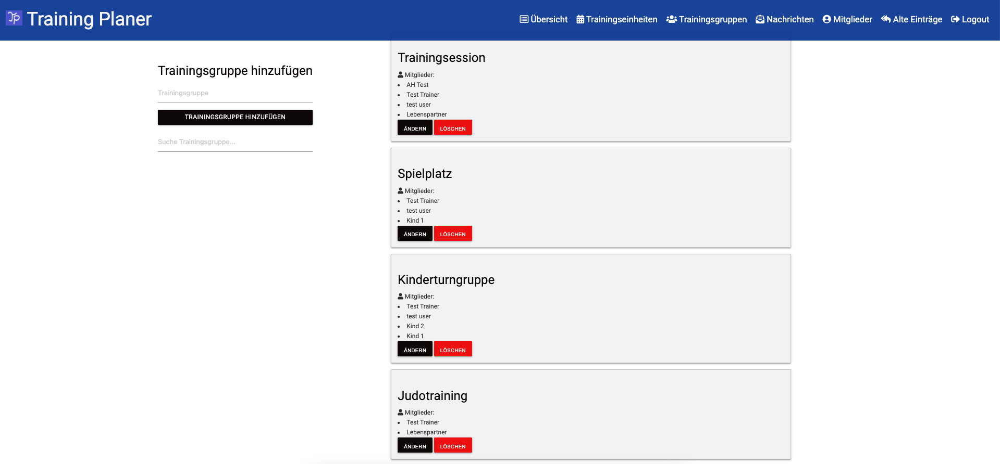
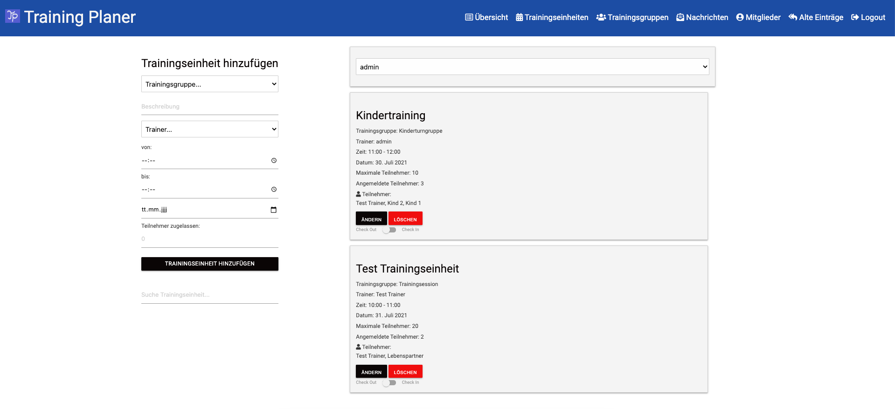
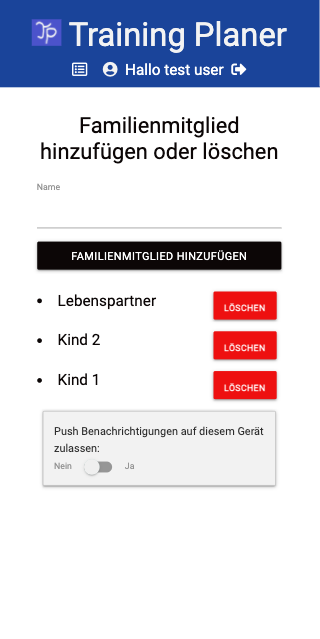
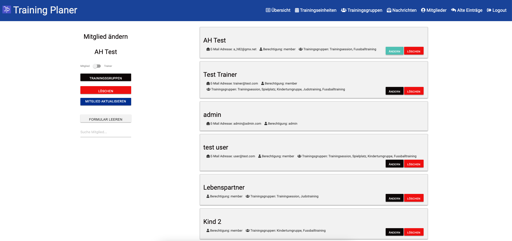
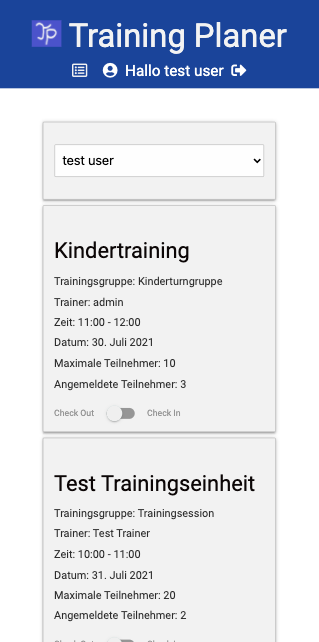
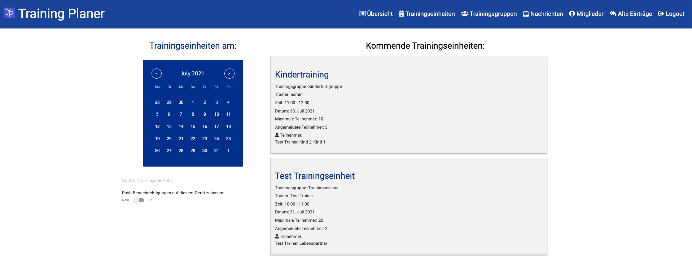
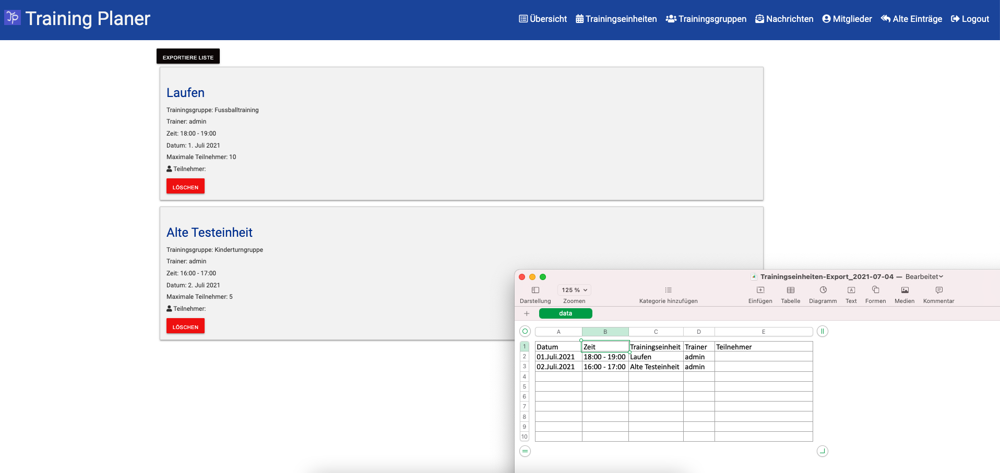

# Training-Planer

Please scroll down for description in English. Thank you!

### Beschreibung:
Organisiere Trainingseinheiten mit deinen Trainingspartnern und Freunden

### Funktionsweise der App:

Es gibt verschiedene Benutzerrollen: admin (Administrator), trainer (Trainer), member (einfaches Mitglied) und none (noch nicht zugelassen vom Administrator)

Der Administrator ist die einzige Rolle, die in der MongoDB-Datenbank zugewiesen wird. Die Anzahl der admins ist nicht beschränkt.

Der Administrator kann auf der Trainingsgruppenseite, Trainingsgruppen erstellen. 

 
<kbd></kbd>
  

Für jede Trainingsgruppe sind dann Trainingseinheiten mit Beschreibung der Trainingseinheit, Trainer, Beginn- und Endzeit sowie bei Bedarf einer Höchstgrenze an Teilnehmern auf der Trainingseinheitenseite erstellbar.

 
<kbd></kbd>
  

Einfache Benutzer können sich mit Namen, E-Mail Adresse und Passwort registrieren, zusätzlich können auch Familienmitglieder angelegt werden. 

 
<kbd></kbd>
  

Der Administrator weist diesen dann auf der Mitgliederseite die Benutzerrolle zu und teilt das neue Mitglied dann in die gewünschten Trainingsgruppen ein. Alternativ kann jedes Mitglied nach der Zuweisung der Mitgliedsrolle auch die Rolle als Trainer zugewiesen bekommen und für eine Trainingseinheit als Trainer eingeteilt werden.

 
<kbd></kbd>
  

Wenn ein Mitglied in eine Trainingsgruppe eingeteilt ist, kann es in seinem Account die geplanten Trainingseinheiten der zugeteilten Trainingsgruppen sehen und sich über einen Switch-Button an- und abmelden. Das Kärtchen mit der Trainingseinheit wechselt beim Ein- und Auschecken zur besseren Übersicht die Farbe. Bei einer voreingestellten Maximalteilnehmeranzahl ist dies nur bis zu dieser Teilnehmerzahl möglich.

 
<kbd></kbd>
<kbd></kbd>
  

Der Administrator kann in seiner Übersicht sehen, wie viele Leute und wer sich für eine Trainingseinheit eingecheckt hat. Außerdem hat er in der Übersicht einen Kalender an dem er die Trainingseinheiten des jeweiligen Tages überblicken kann.

 
<kbd></kbd>
  

Alte Trainingseinheiten verschwinden aus dem Überblick von Administrator und Mitglied. Es gibt einen Reiter mit den vergangenen Trainingseinheiten im admin-Bereich. Dort können die alten Trainingseinheiten vom Administrator eingesehen sowie als Excel-Liste exportiert werden. Ein Löschen aus der Datenbank ist dort ebenfalls möglich.

 
<kbd></kbd>
  

In Bearbeitung ist derzeit eine Versorgung mit E-Mails über Registrierung von neuen Mitgliedern als Hinweis für den admin sowie als Information über neu erstellte oder abgesagte Trainingseinheiten für die Mitglieder, sowie Eingabe eines eigenen Passworts beim Zurücksetzen.

 

### Link zum aktuellen Fortschritt der App:

https://training-planer.de/

Zum Testen als Administrator registriere dich mit

E-Mail: admin@admin.com,
PW: adminUser_01

als Trainer mit:

E-Mail: trainer@test.com,
PW: Trainertest_01

als normaler Nutzer mit:

E-Mail: user@test.com,
PW: Usertest_01

oder registriere dich selbst als einfachen Benutzer mit Namen, E-Mail Adresse und Passwort

 

### Eine Übersicht der verwendeten Programmier-Werkzeuge:

Das Backend wurde mit NodeJS, Express, Passport und MongoDB umgesetzt, das Frontend mit ReactJS.

 

### Ich freue mich, wenn du mich beim Fortschritt der App verfolgst! :)

Solltest du die App selbst gerne benutzen wollen, z.B.: für deinen Sportverein und Hilfe bei der Umsetzung brauchen, schreib mich gerne an.

Ansonsten kannst du das Projekt auch clonen und mit deiner eigenen MongoDB-Datenbank verbinden. Du brauchst dann als globale Variablen deine "mongoURI" als Verbindung zu deiner Datenbank und ein eigenes "jwtSecret" zur Verschlüsselung. Ich wünsche mir dann aber trotzdem einen Hinweis, dass du das Projekt benutzt und Rückmeldungen, wie gut der Einsatz bei dir klappt. ;)

  

## Description:
Organize trainings with your mates

I´m planning an app, which should help organizing trainings with your friends or other training partners.

### How it works:

There are different roles: admin, trainer, members and none.

The admin-role is the only role, which has to be set in the MongoDB database.

The admins can create training groups. 

 
<kbd></kbd>
  

For each training group training sessions with description, trainer, date, begin- and endtime can be created by the admins.

 
<kbd></kbd>
  

Members should be able to register via e-mail address and password, later via Google or Facebook. First they have no role and no rights (none). They have to be set to member by an admin. Then they can be put into the created training groups.

 
<kbd></kbd>
  

When members are put into a training group they can subscribe to the sessions of the respective training-group. 

 
<kbd></kbd>
<kbd></kbd>
  

The training-session can be set to a maximum of members who can subscribe by the admins.

The admin can see the training sessions of a training group and who subscribed to the respective training session in a list.

There is also an overview for the admins with a calendar and the actual training sessions.

 
<kbd></kbd>
  

A list with old sessions can be seen and exported as excel-file.

 
<kbd></kbd>
  

### Link to the actual Progress of the app on Heroku:

https://training-planer.de/

You can register with your own data or use admin rights with:

E-Mail: admin@admin.com,
PW: adminUser_01

use trainer rights with:

E-Mail: trainer@test.com,
PW: Trainertest_01

or use user rights witch:

E-Mail: user@test.com,
PW: Usertest_01

 

### The tools I use to create the app:

The Back-End is set up with Express, Passport and MongoDB, the Front-End with ReactJS

 

### You are welcome to follow my progress!

If you would like to use the app for you or your sports club and need help with the implementation, please text me.

Else you can clone this project and connect it with your own MongoDB Database. You will need "mongoURI" as global variable to connect your database and "jwtSecret" for encryption.
Also I would appreciate, if you let me know, you are using the app, and how it works for you and your mates ;)
